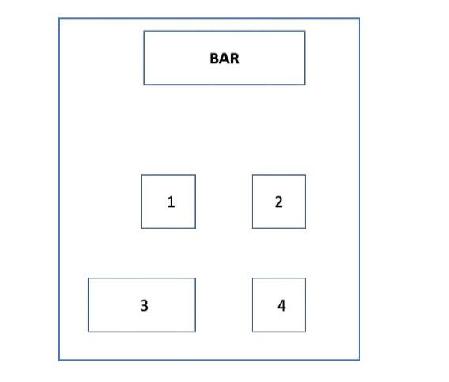

# Robotic coffee shop menaged by an Artificial Intelligence #
=============================================================
This short report concerns the first Artificial Intelligence II assignment with the purpose of modelling a robotic coffee shop scenario in which customers can order two different kind of drinks, cold and warm, served by two robots, one is a bartender and the other one is a waiter. The bartender is responsible for preparing drinks, while the waiter serves customers and cleans tables. There are four main problems to solve with different number of customers and kind of drinks and four optional extensions that include another waiter or serving also biscuits together with cold drinks.The coffee shop layout is illustrated in the Figure:

Just to focus on the syntax about PDDL+ we took inspiration from the website [planning guide](https://planning.wiki/)
The coffee shop layout consists of a bar counter at the very top and four tables for customers.
Each table is 1 meter apart from any other, and the bar is 2 meters away from tables 1 and 2. Table 3 is the only table of 2 square meters, and all others are of 1 square meter.
The barista robot has to prepare drinks ordered by customers. It can be assumed that all the orders are known at the start of the planning problem. 
The waiter robot is responsible for serving customers and cleaning tables. It can either grasp a single drink using one of its grippers or use a tray to carry up to three drinks at once. When using the tray, the waiter robot moves slower to maintain balance. The robot is not allowed to leave the tray on a table, and it must be returned to the bar after use.

## How to launch the planning problem ##
First of all it's necessary to install the ENHSP planning engine, avaiable at the link [ENHSP planning engine](https://gitlab.com/enricos83/ENHSP-Public), in our case we chose to install the enhsp-20 version.
Done that it will be possible to launch one of the planning problem by the command (considering the planner in a folder on the same level of the one of the repository):
```
../ENHSP-Public-enhsp-20/enhsp -o <domain_file> -f <problem_file> -planner <configuration> -tolerance 1
```
## Domain file ##
For doing this assignment we developed a domain.pddl file in which we encoded:
1. Types: describing different types of objects including the robots, the drinks and the tables
2. Predicates: describing properties of the objects (i.e. properties of the drink or the robot), they can be true or false.
3. Functions: fluents that return a number (i.e. the distance between tables, the value for the timer or the number of drink the robot is holding)
4. Actions: describing the changes of the state of the world (i.e. preparing hot/cold drinks, cleaning, moving the robot, etc...)

Since we have used ENHSP (Expressive Numeric Heuristic Search Planner) that does not support durative actions, to model durative actions we've used a sequence of actions (istantaneus), process and event, the idea is that the action trigger the beginning of the process that simulate the duration of the action at the end of which an event will ne triggered stopping the process and realizing the effect of the action.
This also allows to model a multi agent problem, since the process is related to the specific robot, in which each agent can perform different action simultaneously.
All the actions are conditioned by the process Timer based on the value assigned by the action, it will launch different events.
```
(:process Timer
        :parameters (?r -robot)
        :precondition (< (tim ?r) 100)
        :effect (increase (tim ?r) (* #t 1.0))
)
```
In particular:
* 0 < t <= 10 Prepare Hot Drink
* 21 < t <= 27 Prepare Cold Drink
* 38 < t <= 42 Move Slow
* 53 < t <= 55 Move Fast
* 66 < t <= 74 Clean
All the conditions are expressed in time units of the planner (considering the maximum time of each action, the time unit we are considering is equal to 2 time units of the planner).
Moreover the timer works also as a flag to describe if the robot is busy in performing a durative action ((tim ?r)<100) or it's free ((tim ?r) >100).

- Move action: The move action is conditioned by the robot position and the value of the timer, because of, in case of using the tray, the robot must move slowly in order to ensure that everything is balanced.
```
(:action Move
    :parameters (?t1 -table ?r -robot ?t2 -table)
    :precondition (and (waiter ?r) 
                  (robot_pos ?r ?t1) 
                  (>= (tim ?r) 100))
    :effect (and (to ?t2) 
            (when (holding_tray ?r) (assign (tim ?r) 38)) 
            (when (not (holding_tray ?r)) (assign (tim ?r) 53)))
    )  


(:event Moved
    :parameters (?t1 -table ?r -robot ?t2 -table)
    :precondition (and (or (and (holding_tray ?r) 
                  (>= (tim ?r) (+ (* (dist ?t1 ?t2) 2) 38)) 
                  (<= (tim ?r) (+ (* (dist ?t1 ?t2) 2) 48))) 
                  (and (not (holding_tray ?r)) 
                  (>= (tim ?r) (+ (dist ?t1 ?t2) 53)) 
                  (<= (tim ?r) (+ (dist ?t1 ?t2) 63)))) 
                  (to ?t2) (robot_pos ?r ?t1))
    :effect (and (robot_pos ?r ?t2) 
                 (not (to ?t2)) (not (robot_pos ?r ?t1)) 
                 (assign (tim ?r) 150))
)
```
- Drink prepare action: This function deals with the preparation of the drink that effectively ends when the drink is on the table defined as bar.
A second timer like was introduced to simulate the drink temperature (tim c ?d), in detail the hot drinks start with a value of 10 while the cold drink with a value of zero, this difference modify the behavior of the drink prepare action that will take a bigger time for hot drinks and a smaller one for cold ones and will simulate the cooling down of the drinks.
Moreover an additional predicate was introduced to exchange the information of which drink is under preparation between the initial action and final event (drink n ?d), this predicates can be easily deleted by using the drink temperature timer (expressed in the process cooling down) as a flag to pass the same information, but after some trials this doesn't seams to introduce big advantages.
```
(:action Drink_Prepare 
    :parameters (?r -robot ?d -drink ?t -table)
    :precondition (and (not (waiter ?r)) 
                       (robot_pos ?r ?t) 
                       (bar ?t) (>= (tim ?r) 100))
    :effect (and (when (= (tim_c ?d) 10) 
            (and (assign (tim ?r) 0) (drink_n ?d))) 
            (when (= (tim_c ?d) 0) 
            (and (assign (tim ?r) 21) (drink_n ?d)))) 
)    

(:event Drink_Prepared 
    :parameters (?r -robot ?d -drink ?t -table)
    :precondition (and (or (and (= (tim_c ?d) 10) 
                  (>= (tim ?r) 10) (<= (tim ?r) 20)) 
                  (and (= (tim_c ?d) 0) (>= (tim ?r) 27) 
                  (<= (tim ?r) 37))) (drink_n ?d) 
                  (robot_pos ?r ?t) (bar ?t))
    :effect (and (drink_on_table ?d ?t) 
            (assign (tim ?r) 150) 
            (when (= (tim_c ?d) 10) (assign (tim_c ?d) 8)) 
            (not (drink_n ?d)))
)

(:process Cooling_down
    :parameters (?d -drink)
    :precondition (and (<= (tim_c ?d) 8) (> (tim_c ?d) 0))
    :effect (decrease (tim_c ?d) (* #t 1.0))
)
```
- Pick up/Put Down drinks actions: These functions concern the waiter robot and are for the specific for delivering drinks. As shown in the put down drink action the condition of the drink to still be hot ((tim c ?d)>0)  must be respected for serving a hot drink, this is required since the drink from its preparation to its service cool down and we want to force the delivery of hot drinks in the time window in which they are still hot.
Moreover this action trigger the predicates (biscuits deliver ?bis ?t) used to signal the robot that it can move to the bar and pick the biscuits to serve together with the cold drink.
```
(:action Pick_up_drink
    :parameters (?r -robot ?d -drink ?t -table)
    :precondition (and (waiter ?r) (robot_pos ?r ?t) 
                  (or (and (not (holding_tray ?r)) 
                  (= (holding ?r ) 0)) 
                  (and (holding_tray ?r) (< (holding ?r) 3))) 
                  (drink_on_table ?d ?t) (>= (tim ?r) 100))
    :effect (and (increase (holding ?r) 1) 
            (drink_holded ?d ?r) 
            (not (drink_on_table ?d ?t)))
    ) 

(:action Put_down_drink
    :parameters (?r -robot ?d -drink ?t -table ?bis -biscuit)
    :precondition (and (waiter ?r) (robot_pos ?r ?t) 
                  (drink_holded ?d ?r) (>= (tim ?r) 100))
    :effect (and (decrease (holding ?r) 1) 
            (not (drink_holded ?d ?r)) (drink_on_table ?d ?t) 
            (when (and (> (tim_c ?d) 0) (not (bar ?t))) 
            (assign (tim_c ?d) 10)) 
            (when (and (<= (tim_c ?d) 0) (not (bar ?t))) 
            (biscuit_deliver ?bis ?t)))
)
```
- Pick up/ Put down tray actions: These functions are used for giving the possibility to the waiter to use a tray for holding up to three drinks at once. The robot can hold a tray if and only if is not holding a drink yet. 
```
(:action Pick_up_tray
    :parameters (?r -robot ?t -table)
    :precondition (and (waiter ?r) (robot_pos ?r ?t) 
                  (bar ?t) (not (holding_tray ?r)) 
                  (= (holding ?r) 0) (>= (tim ?r) 100))
    :effect (holding_tray ?r)
    )
    
(:action Put_down_tray
    :parameters (?r -robot ?t -table)
    :precondition (and (waiter ?r) (robot_pos ?r ?t) 
                  (bar ?t) (holding_tray ?r) 
                  (= (holding ?r) 0) (>= (tim ?r) 100))
    :effect (not (holding_tray ?r))
)
```
- Pick up/ Put down biscuits actions: These functions deals with delivering food described by the fourth optional problem in which all the customers with cold drinks will also receive a biscuit but the waiter can not bring at the same time the drink and the biscuit
```
(:action Pick_up_biscuit
    :parameters (?r -robot ?bis -biscuit ?t -table ?t1 -table)
    :precondition (and (waiter ?r) (robot_pos ?r ?t) 
                  (bar ?t) (or (and (not (holding_tray ?r)) 
                  (= (holding ?r) 0)) (and (holding_tray ?r) 
                  (< (holding ?r) 3))) (>= (tim ?r) 100)
                  (biscuit_deliver ?bis ?t1))
    :effect (and (increase (holding ?r) 1) 
            (biscuit_holded ?bis ?r))
)

(:action Put_down_biscuit
    :parameters (?r -robot ?bis -biscuit ?t -table)
    :precondition (and (waiter ?r) (robot_pos ?r ?t) 
                  (biscuit_holded ?bis ?r) 
                  (biscuit_deliver ?bis ?t) 
                  (>= (tim ?r) 100))
    :effect (and (decrease (holding ?r) 1) 
            (not (biscuit_holded ?bis ?r)) 
            (biscuit_on_table ?bis ?t) 
            (not (biscuit_deliver ?bis ?t)))
)
```
- Clean action: These functions are responsible of the cleaning action that is constrained by the use of the tray. 
```
(:action Clean
    :parameters (?r -robot ?t -table)
    :precondition (and (waiter ?r) (robot_pos ?r ?t) 
                  (not (holding_tray ?r)) (= (holding ?r) 0) 
                  (not (clean ?t)))
    :effect (and (assign (tim ?r) 66))
)    

(:event Cleaned
    :parameters (?r -robot ?t -table)
    :precondition (and (robot_pos ?r ?t) 
                  (and (>= (tim ?r) (+ (* (t_dim ?t) 4) 66)) 
                  (<= (tim ?r) (+ (* (t_dim ?t) 4) 76))))
    :effect (and (clean ?t) (assign (tim ?r) 150))
)  
```
